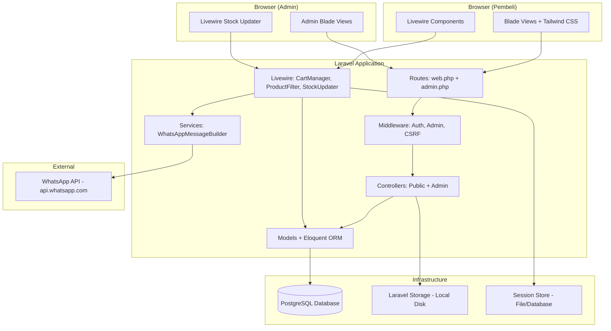
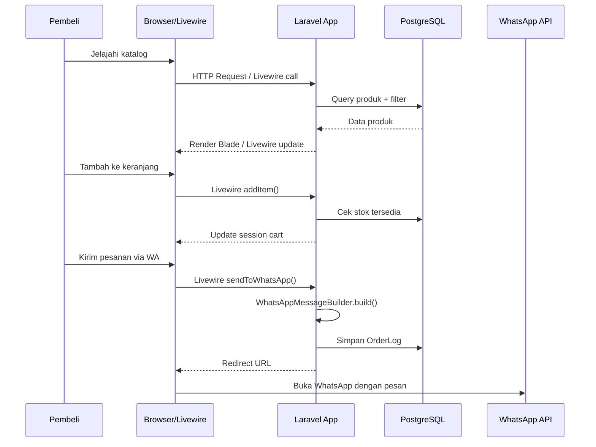
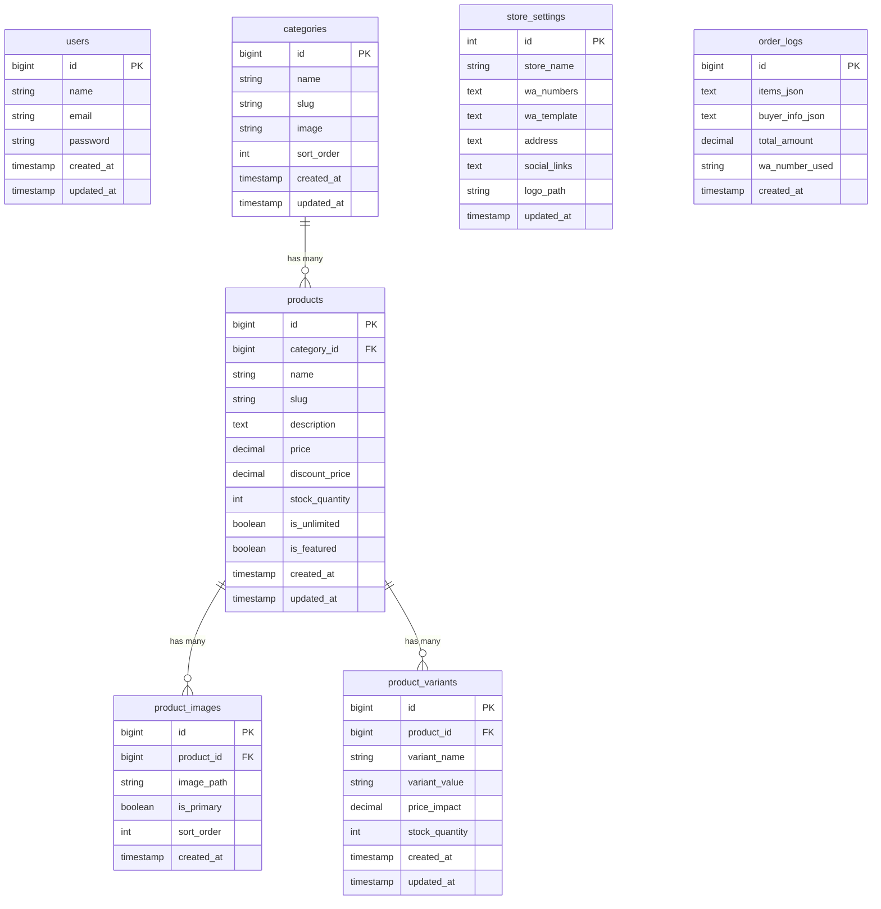

# Design Document: Website Katalog Produk & Pemesanan WhatsApp

## Overview

Sistem ini adalah aplikasi web monolitik berbasis Laravel 11 yang menyediakan katalog produk publik dengan pemesanan via WhatsApp. Arsitektur menggunakan pendekatan full-stack Laravel dengan Blade Templates untuk rendering server-side, Livewire 3 untuk interaktivitas real-time (keranjang, filter, pencarian), dan Tailwind CSS 3 untuk styling responsive mobile-first.

Sistem terdiri dari dua area utama:
1. **Area Publik (Buyer)**: Halaman beranda, katalog produk dengan filter, detail produk dengan indikator stok, keranjang belanja berbasis session, dan pemesanan via WhatsApp.
2. **Area Admin**: Dashboard dengan peringatan stok rendah, manajemen produk (CRUD + multi-image + varian), manajemen kategori, pengaturan toko, dan log pesanan.

Desain mengutamakan kesederhanaan — tidak ada payment gateway, tidak ada sistem checkout kompleks. Seluruh proses transaksi dihandle melalui komunikasi WhatsApp langsung antara pembeli dan penjual.

## Architecture

### Arsitektur Tingkat Tinggi



### Pola Arsitektur

- **MVC (Model-View-Controller)**: Laravel controllers menangani request/response, models mengelola data, Blade views merender UI.
- **Livewire Components**: Menggantikan kebutuhan JavaScript framework untuk interaktivitas (cart, filter, search, stock update).
- **Service Layer**: `WhatsAppMessageBuilder` sebagai service terpisah yang bertanggung jawab atas logika pembuatan pesan.
- **Session-Based Cart**: Keranjang menggunakan Laravel session tanpa perlu tabel database khusus untuk cart.
- **Redirect-Based Ordering**: Pesanan tidak diproses di server — sistem hanya memformat pesan dan redirect ke WhatsApp.

### Alur Request



## Components and Interfaces

### 1. Controllers

#### Public Controllers

| Controller | Responsibility | Routes |
|---|---|---|
| `HomeController` | Render halaman beranda dengan banner, kategori, produk unggulan, dan produk terbaru | `GET /` |
| `CatalogController` | Render halaman katalog dan filter per kategori | `GET /katalog`, `GET /katalog/{category:slug}` |
| `ProductDetailController` | Render halaman detail produk dengan galeri, varian, dan stok | `GET /produk/{product:slug}` |
| `CartController` | Render halaman keranjang (Livewire-driven) | `GET /keranjang` |

#### Admin Controllers

| Controller | Responsibility | Routes |
|---|---|---|
| `DashboardController` | Dashboard dengan low-stock alerts dan order log | `GET /admin` |
| `ProductController` | CRUD produk termasuk gambar dan varian | Resource routes `/admin/products` |
| `CategoryController` | CRUD kategori dengan pengaturan urutan | Resource routes `/admin/categories` |
| `StoreSettingController` | Edit pengaturan toko | `GET /admin/settings`, `PUT /admin/settings` |

### 2. Livewire Components

| Component | Responsibility | Key Methods |
|---|---|---|
| `CartManager` | Mengelola state keranjang, validasi stok, kirim ke WA | `addItem()`, `updateQty()`, `removeItem()`, `sendToWhatsApp()` |
| `ProductFilter` | Filter dan pencarian real-time di katalog | `filter()`, `search()`, `sort()`, `resetFilters()` |
| `StockUpdater` | Quick stock +/- di admin panel | `increment()`, `decrement()`, `setStock()` |
| `ProductSearch` | Real-time search di beranda | `search()`, `clearSearch()` |

### 3. Service Layer

#### WhatsAppMessageBuilder

```php
interface WhatsAppMessageBuilderInterface
{
    /**
     * Build formatted WhatsApp URL with encoded message
     *
     * @param string $phone - Nomor WA tujuan format 62xxx
     * @param string $storeName - Nama toko dari settings
     * @param array $cart - Array item keranjang [{name, variant, qty, price}]
     * @param array $buyer - Data pemesan {name, phone, address, notes}
     * @param string|null $template - Custom template pesan (nullable)
     * @return string - Full WhatsApp API URL
     */
    public static function build(
        string $phone,
        string $storeName,
        array $cart,
        array $buyer,
        ?string $template = null
    ): string;
}
```

### 4. Middleware

| Middleware | Purpose |
|---|---|
| `auth` | Laravel built-in authentication check |
| `AdminMiddleware` | Verifikasi bahwa user terautentikasi adalah admin |
| `VerifyCsrfToken` | CSRF protection (built-in) |

### 5. Model Relationships



## Data Models

### 1. User (Admin)

| Field | Type | Constraints | Description |
|---|---|---|---|
| id | BIGINT | PK, Auto Increment | Primary key |
| name | VARCHAR(255) | NOT NULL | Nama admin |
| email | VARCHAR(255) | UNIQUE, NOT NULL | Email untuk login |
| password | VARCHAR(255) | NOT NULL | Bcrypt hashed password |
| created_at | TIMESTAMP | | Waktu pembuatan |
| updated_at | TIMESTAMP | | Waktu update terakhir |

### 2. Category

| Field | Type | Constraints | Description |
|---|---|---|---|
| id | BIGINT | PK, Auto Increment | Primary key |
| name | VARCHAR(255) | NOT NULL | Nama kategori |
| slug | VARCHAR(255) | UNIQUE, NOT NULL | URL-friendly identifier |
| image | VARCHAR(255) | NULLABLE | Path gambar ikon kategori |
| sort_order | INT | DEFAULT 0 | Urutan tampil |
| created_at | TIMESTAMP | | Waktu pembuatan |
| updated_at | TIMESTAMP | | Waktu update terakhir |

### 3. Product

| Field | Type | Constraints | Description |
|---|---|---|---|
| id | BIGINT | PK, Auto Increment | Primary key |
| category_id | BIGINT | FK → categories.id, NOT NULL | Relasi kategori |
| name | VARCHAR(255) | NOT NULL | Nama produk |
| slug | VARCHAR(255) | UNIQUE, NOT NULL | URL-friendly identifier |
| description | TEXT | NULLABLE | Deskripsi produk |
| price | DECIMAL(12,2) | NOT NULL, >= 0 | Harga asli |
| discount_price | DECIMAL(12,2) | NULLABLE, >= 0 | Harga diskon (null = tanpa diskon) |
| stock_quantity | INT | DEFAULT 0, >= 0 | Jumlah stok tersedia |
| is_unlimited | BOOLEAN | DEFAULT false | True jika stok unlimited |
| is_featured | BOOLEAN | DEFAULT false | Tampil di produk unggulan |
| created_at | TIMESTAMP | | Waktu pembuatan |
| updated_at | TIMESTAMP | | Waktu update terakhir |

**Business Rules:**
- Jika `is_unlimited = true`, `stock_quantity` diabaikan (selalu tersedia)
- Jika `discount_price` tidak null, maka `discount_price < price`
- Slug auto-generated dari `name` menggunakan `Str::slug()`

### 4. ProductImage

| Field | Type | Constraints | Description |
|---|---|---|---|
| id | BIGINT | PK, Auto Increment | Primary key |
| product_id | BIGINT | FK → products.id, CASCADE DELETE | Relasi produk |
| image_path | VARCHAR(255) | NOT NULL | Path file di storage |
| is_primary | BOOLEAN | DEFAULT false | Gambar utama katalog |
| sort_order | INT | DEFAULT 0 | Urutan tampil di galeri |
| created_at | TIMESTAMP | | Waktu upload |

**Business Rules:**
- Setiap produk harus memiliki minimal 1 gambar
- Hanya 1 gambar per produk yang boleh `is_primary = true`
- File disimpan di `storage/app/public/products/`
- Ukuran maksimum 2MB per gambar, format: jpg, png, webp

### 5. ProductVariant

| Field | Type | Constraints | Description |
|---|---|---|---|
| id | BIGINT | PK, Auto Increment | Primary key |
| product_id | BIGINT | FK → products.id, CASCADE DELETE | Relasi produk |
| variant_name | VARCHAR(100) | NOT NULL | Tipe varian (Warna, Ukuran, Rasa) |
| variant_value | VARCHAR(100) | NOT NULL | Nilai varian (Merah, XL, Coklat) |
| price_impact | DECIMAL(12,2) | DEFAULT 0 | Tambahan/pengurangan harga |
| stock_quantity | INT | DEFAULT 0, >= 0 | Stok khusus varian |
| created_at | TIMESTAMP | | Waktu pembuatan |
| updated_at | TIMESTAMP | | Waktu update terakhir |

**Business Rules:**
- Harga final varian = `product.price + variant.price_impact` (atau `product.discount_price + variant.price_impact` jika diskon aktif)
- Jika produk memiliki varian, stok dikelola per varian (bukan dari `products.stock_quantity`)

### 6. StoreSetting

| Field | Type | Constraints | Description |
|---|---|---|---|
| id | INT | PK | Selalu bernilai 1 (singleton) |
| store_name | VARCHAR(255) | NOT NULL | Nama toko |
| wa_numbers | TEXT (JSON) | NOT NULL | Array nomor WA format ["628xxx", ...] |
| wa_template | TEXT | NULLABLE | Custom template pesan WA |
| address | TEXT | NULLABLE | Alamat fisik toko |
| social_links | TEXT (JSON) | NULLABLE | Links sosmed {"instagram": "...", "tiktok": "...", "facebook": "..."} |
| logo_path | VARCHAR(255) | NULLABLE | Path logo toko |
| updated_at | TIMESTAMP | | Waktu update terakhir |

**Business Rules:**
- Tabel ini hanya memiliki 1 row (singleton pattern)
- `wa_numbers` disimpan sebagai JSON array untuk mendukung rotasi nomor
- Format nomor WA harus dimulai dengan "62"

### 7. OrderLog

| Field | Type | Constraints | Description |
|---|---|---|---|
| id | BIGINT | PK, Auto Increment | Primary key |
| items_json | TEXT (JSON) | NOT NULL | Snapshot item pesanan [{name, variant, qty, price}] |
| buyer_info_json | TEXT (JSON) | NOT NULL | Data pemesan {name, phone, address, notes} |
| total_amount | DECIMAL(12,2) | NOT NULL | Total estimasi harga |
| wa_number_used | VARCHAR(20) | NOT NULL | Nomor WA yang digunakan |
| created_at | TIMESTAMP | | Waktu pesanan dikirim |

**Business Rules:**
- Data disimpan sebagai JSON snapshot (bukan relasi) agar histori tidak berubah saat produk diubah/dihapus
- Order log hanya bersifat informatif — bukan sebagai order management system

### Session Cart Structure

Keranjang disimpan di Laravel session dengan struktur:

```php
session('cart') = [
    [
        'product_id' => 1,
        'variant_id' => 3,        // null jika tanpa varian
        'name' => 'Kemeja Flanel',
        'variant' => 'Ukuran L / Warna Hitam', // null jika tanpa varian
        'price' => 150000,         // harga satuan final (termasuk price_impact)
        'qty' => 2,
        'max_stock' => 10,         // stok tersedia saat ditambahkan
        'image' => 'products/kemeja-flanel-1.jpg',
    ],
    // ... more items
];
```

## Correctness Properties

*A property is a characteristic or behavior that should hold true across all valid executions of a system — essentially, a formal statement about what the system should do. Properties serve as the bridge between human-readable specifications and machine-verifiable correctness guarantees.*

### Property 1: Filter katalog mengembalikan hanya produk yang memenuhi semua kriteria filter

*For any* kombinasi filter (kategori, rentang harga, ketersediaan stok) yang diterapkan pada katalog, semua produk yang dikembalikan SHALL memenuhi SEMUA kriteria filter yang aktif secara simultan.

**Validates: Requirements 2.2, 2.3, 2.4**

### Property 2: Pengurutan produk menghasilkan urutan yang benar

*For any* kumpulan produk dan opsi pengurutan yang dipilih (terbaru, termurah, termahal), daftar produk yang ditampilkan SHALL terurut secara benar sesuai kriteria tersebut.

**Validates: Requirements 1.4, 2.5**

### Property 3: Pencarian real-time mengembalikan hasil yang relevan

*For any* query pencarian yang dimasukkan, semua produk yang dikembalikan SHALL mengandung query tersebut dalam nama produk atau deskripsi produk.

**Validates: Requirements 1.5**

### Property 4: Harga varian dihitung dengan benar

*For any* produk dan varian yang dipilih, harga yang ditampilkan SHALL sama dengan harga dasar produk (atau discount_price jika ada) ditambah price_impact dari varian tersebut.

**Validates: Requirements 3.6**

### Property 5: Kuantitas keranjang tidak pernah melebihi stok tersedia

*For any* operasi penambahan atau update kuantitas pada keranjang, kuantitas akhir item SHALL selalu kurang dari atau sama dengan stok tersedia untuk produk atau varian tersebut.

**Validates: Requirements 4.2, 4.3**

### Property 6: Kalkulasi subtotal dan total keranjang selalu akurat

*For any* keranjang dengan item-item di dalamnya, subtotal setiap item SHALL sama dengan harga satuan dikali kuantitas, dan total keseluruhan SHALL sama dengan jumlah semua subtotal.

**Validates: Requirements 4.5**

### Property 7: Validasi form pemesan menolak data yang tidak valid

*For any* input form data pemesan, validasi SHALL menolak input dimana nama kurang dari 3 karakter, nomor WhatsApp kurang dari 10 digit, atau alamat kurang dari 10 karakter, dan menerima input yang memenuhi semua kriteria.

**Validates: Requirements 4.6**

### Property 8: WhatsApp Message Builder menghasilkan URL yang lengkap dan valid

*For any* data keranjang dan data pemesan yang valid, WhatsApp_Message_Builder SHALL menghasilkan URL yang dimulai dengan `https://api.whatsapp.com/send`, mengandung nomor telepon dari Store_Settings, dan pesan ter-encode yang mencakup semua nama produk, kuantitas, harga, total estimasi, serta seluruh data pemesan.

**Validates: Requirements 5.1, 5.2**

### Property 9: Order log mencatat snapshot pesanan secara akurat

*For any* pesanan yang dikirim ke WhatsApp, Order_Log yang dibuat SHALL mengandung data items dan buyer info yang identik dengan data keranjang dan form pemesan pada saat pengiriman.

**Validates: Requirements 5.3**

### Property 10: Session keranjang kosong setelah pengiriman pesanan

*For any* pengiriman pesanan yang berhasil ke WhatsApp, session keranjang SHALL bernilai kosong (empty array) setelah operasi selesai.

**Validates: Requirements 5.4**

### Property 11: Rotasi nomor WhatsApp mendistribusikan secara merata

*For any* urutan N pesanan dan M nomor WhatsApp yang dikonfigurasi, distribusi penggunaan nomor SHALL merata (setiap nomor digunakan mendekati N/M kali).

**Validates: Requirements 5.5**

### Property 12: Peringatan stok rendah menampilkan produk/varian yang benar

*For any* kumpulan produk dan varian, peringatan stok rendah di dashboard admin SHALL menampilkan semua dan hanya item yang memiliki stock_quantity kurang dari atau sama dengan 2 dan is_unlimited = false.

**Validates: Requirements 7.1**

### Property 13: Auth guard menolak semua akses admin tanpa autentikasi

*For any* route admin yang diakses tanpa autentikasi, sistem SHALL mengarahkan request ke halaman login.

**Validates: Requirements 7.3, 12.5**

### Property 14: Cascade delete menghapus semua data terkait produk

*For any* produk yang dihapus, semua product_images dan product_variants yang berelasi SHALL juga terhapus dari database.

**Validates: Requirements 8.5**

### Property 15: Quick stock update menghasilkan nilai yang benar

*For any* operasi increment (+) atau decrement (-) pada stok, nilai stok hasil SHALL sama dengan nilai stok sebelumnya ditambah atau dikurangi jumlah yang ditentukan, dan SHALL tidak pernah bernilai kurang dari 0.

**Validates: Requirements 8.6**

### Property 16: Slug generation menghasilkan format yang konsisten

*For any* nama produk, slug yang dihasilkan SHALL mengandung hanya huruf kecil, angka, dan tanda hubung, tanpa spasi atau karakter khusus, dan SHALL unik di database.

**Validates: Requirements 8.7**

### Property 17: Proteksi penghapusan kategori yang memiliki produk

*For any* kategori yang memiliki satu atau lebih produk terkait, operasi delete SHALL gagal dan kategori tetap ada. Untuk kategori tanpa produk, operasi delete SHALL berhasil.

**Validates: Requirements 9.4**

### Property 18: Urutan kategori ditampilkan sesuai sort_order

*For any* kumpulan kategori dengan nilai sort_order yang berbeda, tampilan kategori di halaman publik SHALL mengikuti urutan ascending berdasarkan sort_order.

**Validates: Requirements 9.3**

### Property 19: Validasi nomor WhatsApp format internasional

*For any* input nomor WhatsApp, validasi SHALL menerima hanya nomor yang dimulai dengan "62" dan memiliki panjang 10-15 digit, dan menolak format lainnya.

**Validates: Requirements 10.3**

### Property 20: Harga diskon ditampilkan dengan format coret yang benar

*For any* produk yang memiliki discount_price (not null), tampilan SHALL menunjukkan harga asli (price) dengan format coret dan discount_price sebagai harga aktif. Produk tanpa discount_price SHALL menampilkan price sebagai harga aktif tanpa format coret.

**Validates: Requirements 3.2**

### Property 21: Invariant satu gambar primary per produk

*For any* produk dengan satu atau lebih gambar, tepat satu gambar SHALL memiliki is_primary = true.

**Validates: Requirements 8.2**

## Error Handling

### Public-Facing Errors

| Skenario | Penanganan |
|---|---|
| Produk tidak ditemukan (slug invalid) | Tampilkan halaman 404 dengan navigasi kembali ke katalog |
| Stok habis saat tambah ke keranjang | Tampilkan flash message error, tolak penambahan |
| Stok berkurang setelah item ada di keranjang | Validasi ulang saat sendToWhatsApp(), update max_stock, beri notifikasi |
| Form validasi gagal | Tampilkan pesan error di bawah field terkait, pertahankan input sebelumnya |
| File upload melebihi 2MB | Tampilkan pesan error spesifik tentang batas ukuran file |
| File upload format tidak didukung | Tampilkan pesan error dengan format yang diterima (jpg, png, webp) |
| Kategori tidak ditemukan | Tampilkan halaman 404 |
| Session expired (keranjang hilang) | Tampilkan pesan informatif bahwa keranjang telah expired, arahkan ke katalog |

### Admin-Facing Errors

| Skenario | Penanganan |
|---|---|
| Validasi produk gagal | Tampilkan error per field, pertahankan input sebelumnya |
| Penghapusan kategori dengan produk terkait | Tampilkan error dan saran untuk memindahkan produk terlebih dahulu |
| Slug duplikat | Auto-append angka incrementing (produk-1, produk-2) |
| Database connection error | Log error, tampilkan halaman error umum |
| Storage write failure | Log error, tampilkan pesan gagal upload |
| Quick stock decrement pada stok 0 | Tolak operasi, stok tetap 0, tampilkan notifikasi |

### Livewire Error Handling

```php
// Pattern untuk Livewire component error handling
try {
    // operasi
} catch (\Exception $e) {
    session()->flash('error', 'Terjadi kesalahan. Silakan coba lagi.');
    Log::error('Livewire error: ' . $e->getMessage());
}
```

## Testing Strategy

### Pendekatan Pengujian

Proyek ini menggunakan dual testing approach:
1. **Unit Tests (PHPUnit)** — Untuk contoh spesifik, edge cases, dan integrasi
2. **Property-Based Tests (QuickCheck/Eris)** — Untuk properti universal yang berlaku di semua input

### Library Testing

| Jenis | Library | Konfigurasi |
|---|---|---|
| Unit Test | PHPUnit (bawaan Laravel) | `phpunit.xml` |
| Property Test | [giorgiosironi/eris](https://github.com/giorgiosironi/eris) | Minimum 100 iterasi per property |
| Feature/Integration Test | Laravel HTTP Tests | Database transactions per test |
| Livewire Test | Livewire Testing Utilities | `Livewire::test()` |

### Struktur Test

```
tests/
├── Unit/
│   ├── Services/
│   │   └── WhatsAppMessageBuilderTest.php
│   ├── Models/
│   │   ├── ProductTest.php
│   │   ├── CategoryTest.php
│   │   └── ProductVariantTest.php
│   └── Livewire/
│       ├── CartManagerTest.php
│       ├── ProductFilterTest.php
│       └── StockUpdaterTest.php
├── Feature/
│   ├── Public/
│   │   ├── HomePageTest.php
│   │   ├── CatalogTest.php
│   │   ├── ProductDetailTest.php
│   │   └── CartFlowTest.php
│   ├── Admin/
│   │   ├── ProductManagementTest.php
│   │   ├── CategoryManagementTest.php
│   │   ├── StoreSettingsTest.php
│   │   └── DashboardTest.php
│   └── Auth/
│       └── AdminAuthTest.php
└── Property/
    ├── CatalogFilterPropertyTest.php     (Property 1, 2, 3)
    ├── PriceCalculationPropertyTest.php  (Property 4, 6, 20)
    ├── CartValidationPropertyTest.php    (Property 5, 7, 10)
    ├── WhatsAppBuilderPropertyTest.php   (Property 8, 9, 11, 19)
    ├── StockManagementPropertyTest.php   (Property 12, 15)
    ├── AuthGuardPropertyTest.php         (Property 13)
    ├── DataIntegrityPropertyTest.php     (Property 14, 17, 21)
    └── SlugGenerationPropertyTest.php    (Property 16, 18)
```

### Property Test Configuration

Setiap property test HARUS:
- Menjalankan minimum **100 iterasi**
- Menyertakan tag referensi ke design property
- Format tag: `Feature: product-catalogue-whatsapp, Property {N}: {title}`

Contoh:

```php
/**
 * Feature: product-catalogue-whatsapp, Property 8: WhatsApp Message Builder menghasilkan URL yang lengkap dan valid
 * Validates: Requirements 5.1, 5.2
 */
public function testWhatsAppUrlContainsAllOrderInfo(): void
{
    $this->forAll(
        Generator\associative([
            'cart' => Generator\vector(Generator\int(1, 5), $this->cartItemGenerator()),
            'buyer' => $this->buyerDataGenerator(),
            'phone' => Generator\suchThat(fn($s) => str_starts_with($s, '62'), Generator\string()),
        ])
    )->then(function ($data) {
        $url = WhatsAppMessageBuilder::build($data['phone'], 'Test Store', $data['cart'], $data['buyer']);
        
        $this->assertStringStartsWith('https://api.whatsapp.com/send', $url);
        $this->assertStringContainsString($data['phone'], $url);
        // verify encoded message contains all product names, total, buyer info
    });
}
```

### Unit Test Focus Areas

Unit tests berfokus pada:
- **Edge cases**: Stok 0, keranjang kosong, single item, harga 0
- **Error conditions**: Invalid input, file too large, format salah
- **Integration points**: Controller → Model, Livewire → Session
- **Specific examples**: Known valid/invalid data combinations

### Keputusan Desain

| Keputusan | Alasan |
|---|---|
| Session-based cart (bukan database) | Lebih ringan, tidak perlu tabel cart, cocok untuk flow sederhana tanpa user registration |
| JSON snapshot di OrderLog | Data historis tidak berubah saat produk di-edit/hapus |
| Singleton StoreSetting | Hanya 1 toko, tidak perlu multi-tenant |
| Livewire untuk interaktivitas | Tidak perlu SPA/API terpisah, tetap dalam ekosistem Laravel |
| Eris untuk property testing | Library PBT terbaik untuk PHP/Laravel ecosystem |
| Local disk storage | Sesuai kebutuhan VPS deployment, tidak perlu S3 untuk skala kecil |
